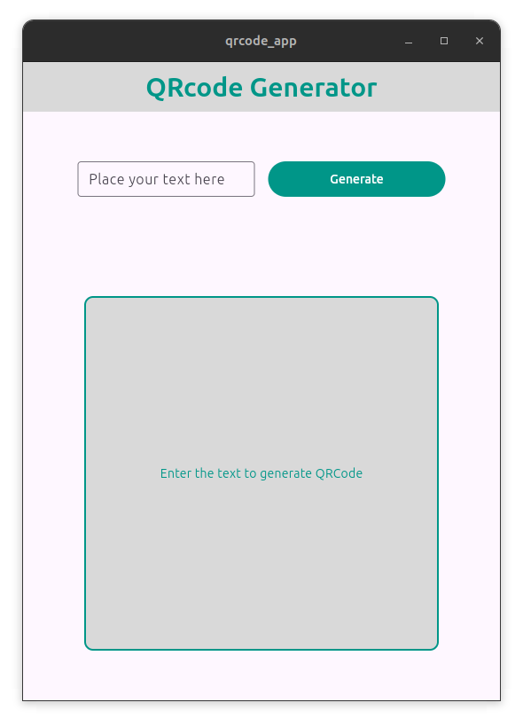

Gerador de QRCode em tempo real feito em Flutter, traduz qualquer texto em um QRCode e faz display na tela, gerando a imagem inMemory. Testado em Android e Linux Desktop.

``` flutter run ``` 

Irá rodar o código fonte no modo de desenvolvimento.


Versão Android:
[APK](./releases/app-release.apk)


Versão Linux:
Ainda não disponível!

